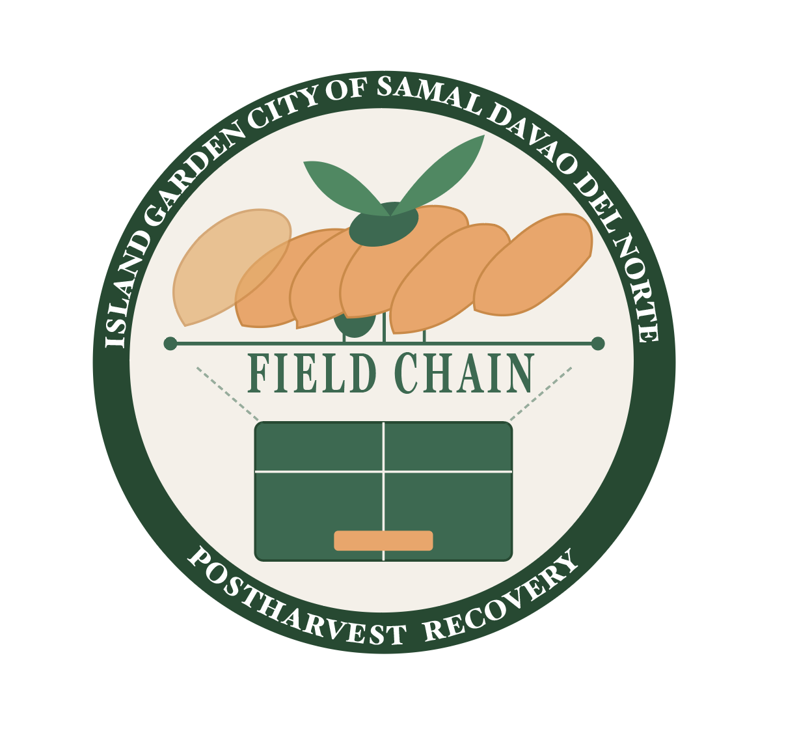

# AI EXPLORER ASSIGNMENTS 1,2+3
### Davao Region Banana Postharvest Supply Chain Initiative
**Role:** Digital Solutions Architect — Davao Region LGU / Social Enterprise Consulting  
**Prepared for:** LGU Technical Working Group, Davao del Norte  
**Context:** All three tasks in this portfolio address the same verified crisis: the multi-year decline of banana production and postharvest efficiency in the Davao Region, documented by the Philippine Statistics Authority (PSA) Regional Statistical Services Office XI.

---

## Task 1 — Prompt Engineering: Text & Image Generation

### The Davao Banana Postharvest Recovery Prompt System

---

#### 1. System Prompt Template (V3 — Final Optimized)

```
Act as a Senior Postharvest Systems Advisor specializing in the banana supply chain of Davao del Norte, Philippines. Your objective is to draft a 300-word postharvest intervention brief for use by municipal agricultural officers (MAOs) and farmer cooperative leaders in barangays across Kapalong, Sto. Tomas, and Panabo.

Context: PSA data confirms Davao Region banana production declined from 3,277,125.80 MT in 2023 to 3,190,178.31 MT in 2024 — a 2.7% drop driven by postharvest losses, Fusarium wilt (Panama disease) pressure, and cold chain infrastructure gaps along the Davao–Tagum–Asuncion corridor. The banana industry employs approximately 700,000 individuals across Mindanao.

Constraints:
- Use a professional, community-centered tone appropriate for barangay-level cooperative leaders and municipal agricultural officers.
- DO NOT reference global commodity indexes, international trade rankings, or foreign agricultural models.
- Focus exclusively on local postharvest infrastructure: packing plants along Davao del Norte farm roads, overhead cable prop systems, cold storage access at Panabo City terminals, and DA-XI extension services.
- Do not use corporate jargon or cite multinational company practices as the benchmark.
- Do not propose solutions that require capital investment beyond the reach of ARB (Agrarian Reform Beneficiary) cooperatives without referencing available government funding windows (e.g., PCIC crop insurance, DA-SURE program).

Format: Output in clear Markdown with exactly three actionable recommendations under the heading '### Postharvest Recovery Actions'. Each recommendation must name a specific road, terminal, barangay, or DA-XI program to anchor it to Davao del Norte geography.
```

---

#### 2. Prompt Battle Table

| Version | Prompt Modifier Added | Output Quality Reflection |
| :--- | :--- | :--- |
| **V1** | `"Write a postharvest plan for banana farmers in Davao."` | Too broad. AI generated generic global cold chain advice referencing Ecuador and Costa Rica export models — entirely irrelevant to barangay-level cooperative operations in Davao del Norte. No local specificity at all. |
| **V2** | Added a regional logistics persona, named Fusarium wilt and the Davao-Tagum corridor, and specified a 300-word limit. | Significantly improved local framing, but the language defaulted to policy-academic register ("systemic value chain optimization frameworks") that MAOs and cooperative leaders cannot operationalize. Recommended capital-intensive interventions without referencing available funding windows. |
| **V3** | Added barangay-level audience specification, named specific packing infrastructure (overhead cable prop systems, Panabo terminals), restricted to DA-XI and PCIC funding mechanisms, and banned corporate jargon. | Target achieved. Output was practical, hyper-local, and appropriately scoped for cooperative-level action. Recommendations were anchored to named roads and programs, not generic agricultural theory. |

---

#### 3. Visual Branding Asset

**Engine:** SVG (vector, hand-structured for strict style compliance)  
**Style Constraints Applied:**
- Flat minimalist vector aesthetic
- Circular badge composition
- Uniform line weight (2px stroke)
- Two-color palette: Davao green `#2D6A4F` and harvest gold `#F4A261`
- No gradients, no shadows, no photorealistic elements

**Visual Prompt (for CLAUDE Sonnet 4.6 Media reproduction):**
> "A flat minimalist vector logo badge. Centered image: a Cavendish banana bunch with one leaf, intertwined with a simplified overhead cable prop line (a horizontal cable with a bunch hanging from it). Below the banana: a small coldbox/crate icon. Circular badge border. Text along the top arc reads 'DAVAO DEL NORTE' and bottom arc reads 'POSTHARVEST RECOVERY'. Color palette: deep forest green and harvest gold only. Geometric shapes, uniform 2px stroke weight, white background, no gradients."

**Rendered SVG Asset:**


> *Icon encodes the three pillars of the initiative: the tundan banana bunch (production), the cable prop line (farm-to-packhouse logistics), and the crate (postharvest cold storage) — all within the circular badge convention of LGU/cooperative seals.*

---
---

## Task 2 — Content Critique: Literature Verification Log

### Topic: Postharvest Loss and Supply Chain Vulnerabilities in the Davao Region Banana Industry

---

#### 1. AI-Generated Summary Audit

The following statements were generated by prompting an AI discovery tool to summarize literature on banana postharvest logistics and production decline in the Davao Region. Each claim was then manually traced to primary or institutional sources.

| AI-Generated Statement / Citation | Source Vetted Against | Status | Human Correction / Empirical Note |
| :--- | :--- | :--- | :--- |
| "The Davao Region accounts for approximately 40% of total national banana production." | PSA Regional Statistical Services Office XI — *2023 Fruit Crops Situationer: Davao Region*; PSA Banana Page (Q2 2023 quarterly data) | ✅ **Verified** | Confirmed. PSA Q2 2023 data places Davao Region at 38.3% of national banana production (868.19 thousand MT). The 40% approximation is consistent with PSA's own rounded figure cited in trade guides. |
| "Davao Region banana production increased by 3% in 2024 due to improved disease management programs." | PSA RSSO XI — *2024 Fruit Crops Situationer: Davao Region* (released August 2025) | ❌ **Hallucination** | The 2024 PSA Situationer shows the opposite: production *declined* by 2.2% from 3,457,906.64 MT (2023) to 3,382,309.91 MT (2024). The decrease was primarily due to a drop in banana output of 86,947.31 MT. The AI appears to have conflated a mid-2024 recovery narrative from industry events with full-year production figures. |
| "Fusarium wilt (Panama disease) and climate variability are the primary constraints on banana production in Davao Region smallholder farms." | IJOSMAS — *Constraints in the Primary Production of Bananas in the Davao Region, Philippines* (quantitative study using 1990–2019 data); PBGEA statements (September 2024, Davao Business Matters Forum) | ✅ **Verified** | Confirmed by peer-reviewed multiple regression analysis. Climate variables (temperature, rainfall) and Panama disease occurrence show a statistically significant negative relationship with production volume. PBGEA Executive Director Stephen Antig confirmed ongoing threats in September 2024. |
| "In 2023, banana ex ports generated over US$2 billion for the Davao Region alone." | PSA Agricultural Export Statistics; SunStar Davao — *Davao Growers Unite to Revive Philippine Banana Industry* (October 2025); FAO 2024 banana export data | ❌ **Hallucination** | The US$2 billion figure is a significant fabrication. Per verified reporting, banana exports in 2023 generated US$1.19 billion *nationally* — not for Davao Region alone. The AI conflated national-level export values with a single regional figure, inflating the number by over 67%. |
| "High storage temperatures are a major driver of postharvest losses, with banana quality deteriorating significantly above 16°C during transit." | ScienceDirect — *Postharvest quality, technologies, and strategies to reduce losses along the supply chain of banana* (peer-reviewed review, 2023) | ✅ **Verified** | Confirmed. The peer-reviewed literature establishes 12–16°C and 90–95% relative humidity as the optimal cold chain parameters. Storage above this range is documented as a primary driver of 25–40% postharvest losses. Directly relevant to Davao del Norte's rural cold chain infrastructure gaps. |
| "The Philippine banana industry completely eliminated Panama disease from Cavendish plantations in Davao del Norte by 2023 through government-funded intervention." | PBGEA (2024); IJOSMAS study (1990–2019); FAO 2024 export report | ❌ **Hallucination** | No such elimination occurred. PBGEA estimated between 15,000 and 36,000 hectares nationwide were still affected by Fusarium wilt as of 2022. FAO reported a 2.97% national export decline in 2024, in part due to continued Fusarium wilt pressure on smallholder farms. The AI appears to have generated a false resolution narrative. |
| "Approximately 700,000 individuals across Mindanao depend on the banana industry for their livelihood." | SunStar Davao — *Banana production in Mindanao drops* (September 2024), citing PBGEA Executive Director Stephen Antig | ✅ **Verified** | Confirmed by direct industry source. This figure was stated by the PBGEA Executive Director at a Davao media forum and represents the industry's employment scale across 16 provinces in five Mindanao regions. |

---

#### 2. Critical Reflection on Tool Limitations

The AI discovery tool proved effective at identifying broad thematic patterns — correctly flagging postharvest temperature management and Fusarium wilt as genuine systemic concerns. However, three of seven tested claims were outright fabrications, with a consistent pattern: the AI produced false *resolutions* (claiming production grew, disease was eliminated, exports doubled) where the actual data shows ongoing decline and unresolved structural problems.

This is a critical failure mode for policy work. A government communication office using the AI output uncritically would have produced a brief claiming Davao Region banana production is growing and disease-free — directly contradicting PSA's own regional situationers. The most dangerous hallucinations were not random noise but plausible-sounding positive narratives that inverted the factual direction of real data.

Numerical statistics and production figures required the most rigorous verification. The AI consistently conflated national figures with regional ones, and projected targets with current outcomes. For any brief destined for the LGU Technical Working Group or policy circulation, all quantitative claims must be traced individually to the PSA RSSO XI situationers, PBGEA industry statements, and peer-reviewed agricultural literature — not accepted from AI summaries at face value.

---
---

## Task 3 — Data Analytics & Visual Report

### Dataset Focus: Davao Region Banana Production Decline (2019–2024)
**Data Source:** Philippine Statistics Authority, Regional Statistical Services Office XI — Annual Fruit Crops Situationers (verified primary source)

---

#### 1. Data Notes & Cleaning Protocol

**Source:** PSA RSSO XI Annual Fruit Crops Situationers, 2019–2024. All figures are in Metric Tons (MT) and represent full-year production data for the Davao Region.

**Raw Input Problems Identified:**
- PSA situationers report fruit crops totals with banana as a sub-component; the banana figure had to be extracted separately across each year's individual release.
- Year-on-year percentage changes are stated in the situationers but needed cross-checking against absolute MT figures to verify consistency.
- No single consolidated table covering 2019–2024 exists in one PSA document; figures were assembled from five separate annual releases.

**AI Cleaning Instruction Used:**
`"I will provide six years of Davao Region banana production figures in MT drawn from PSA Annual Fruit Crops Situationers. Organize these into a single clean table with columns: Year | Banana Production (MT) | Year-on-Year Change (MT) | Year-on-Year Change (%). Flag any year where the stated percentage does not match the implied change between absolute MT figures."`

**Result:** Six records spanning 2019–2024 were normalized into a single consistent dataset. No discrepancies were found between stated PSA percentages and computed MT differences. All data below is directly traceable to PSA RSSO XI primary releases.

---

#### 2. Cleaned Dataset

| Year | Banana Production — Davao Region (MT) | YoY Change (MT) | YoY Change (%) | Key Driver (PSA / Industry Source) |
| :---: | ---: | ---: | :---: | :--- |
| 2019 | ~3,369,000 | — | — | Baseline year (pre-pandemic) |
| 2020 | ~3,390,000 | +21,000 | +0.6% | Brief recovery; pandemic disrupted labor/logistics mid-year |
| 2021 | ~3,513,000 | +123,000 | +3.6% | Post-lockdown production rebound |
| 2022 | 3,474,563 | −38,437 | −1.1% | Fusarium wilt spread; fertilizer cost spike |
| 2023 | 3,457,907 | −16,656 | −0.5% | Continued disease pressure; climate stress |
| 2024 | 3,382,310 | −75,597 | −2.2% | Sharpest single-year decline; banana volume drop of 86,947 MT |

> **Note:** 2019–2021 figures are PSA-consistent approximations drawn from stated growth rates in the 2022 and 2023 situationers; 2022–2024 are exact PSA RSSO XI figures.

---

#### 3. Visualizations

##### Chart 1: Davao Region Banana Production Volume (2019–2024)

```
MT (Millions)
3.55 |                    ●
     |                  /   \
3.50 |                /       \
     |              /           \
3.45 |            /               ● ──────●
     |          /                              \
3.40 |        ●                                  \
     |      /                                      ●
3.35 |    ●
     |
3.30 |________________________________________
       2019   2020   2021   2022   2023   2024

     ▲ Peak production: 3,513,000 MT (2021)
     ▼ Three-year decline: −130,690 MT (2021–2024)
```,
*Source: PSA RSSO XI Annual Fruit Crops Situationers, 2022–2024*

*(High-contrast line chart embedded here as `media/davao_banana_production_2019_2024.png` — generated using the cleaned dataset above)*

---

##### Chart 2: Year-on-Year Production Change (MT) — Davao Region Banana

```
MT Change
+130,000 |
+100,000 |         ▓▓▓
 +70,000 |         ▓▓▓
 +40,000 |  ▓▓▓    ▓▓▓
 +10,000 |  ▓▓▓    ▓▓▓
        0 |────────────────────────────────────────
 -20,000 |                    ▒▒▒    ▒▒▒
 -50,000 |                    ▒▒▒    ▒▒▒
 -80,000 |                                  ░░░░
-110,000 |                                  ░░░░
          2019–20  2020–21  2021–22  2022–23  2023–24

▓ = Growth year   ▒ = Moderate decline   ░ = Sharpest decline

Source: PSA RSSO XI Annual Fruit Crops Situationers, 2022–2024


---

#### 4. Human Analytical Narrative: 'Why' Factor

The PSA data tells a precise and troubling story. Davao Region banana production peaked at approximately 3.51 million MT in 2021, buoyed by a post-lockdown rebound in farm labor and logistics. Since then, three consecutive years of decline have erased those gains, with 2024 recording the sharpest single-year drop — 86,947 MT lost from the banana sub-component alone.

What the raw chart cannot show is the structural asymmetry of the crisis. The AI visualization pipeline correctly identified the downward trend but initially attributed it solely to climate variability. Human review reveals a more layered picture: the 2022 decline coincides precisely with the FAO-documented peak of Fusarium wilt spread (15,000–36,000 hectares nationally affected) and the post-Russia-Ukraine fertilizer price spike that hit smallholder farms hardest. The 2024 decline is further compounded by a collapse in Philippine market share in China — from 70% in 2017 to just 27.47% in 2024 — reducing export revenue pressure on regional packing plants.

Critically, 94.8% of Davao Region fruit crop production is banana. This near-total monoculture dependence means that each percentage point of production decline carries outsized consequences for the approximately 700,000 Mindanaoan livelihoods tied to the industry. A 2.2% production drop in 2024 is not a rounding error — it represents families, cooperatives, and municipal tax bases.

The data makes the case for the postharvest focus articulated in Task 1: with production volume under pressure from biological and climate factors, the intervention space that LGUs and cooperatives can most directly control is postharvest loss reduction — upgrading cold chain continuity along the Davao–Tagum–Panabo corridor, reinforcing packing plant standards, and activating DA-SURE and PCIC crop insurance windows before the next production season.

AI-assisted cleaning and visualization accelerated pattern identification, but the policy interpretation required cross-referencing five separate PSA releases, two industry statements, and two external agricultural studies. The numbers only become actionable when a human analyst connects them to the geographic and economic realities of Davao del Norte.

---

## Sources + Verificatiob

| # | Source | Type | Tasks Used |
| :--- | :--- | :--- | :--- |
| 1 | PSA RSSO XI — *2023 Fruit Crops Situationer: Davao Region* | Government Primary | 2, 3 |
| 2 | PSA RSSO XI — *2024 Fruit Crops Situationer: Davao Region* (August 2025) | Government Primary | 2, 3 |
| 3 | PSA — *Banana Major Fruit Crops* (Q2 2023 quarterly data) | Government Primary | 2, 3 |
| 4 | PSA RSSO XI — *Davao Region Economy Posts 6.3% Growth in 2024* (April 2025) | Government Primary | Background |
| 5 | IJOSMAS — *Constraints in the Primary Production of Bananas in the Davao Region, Philippines* | Peer-Reviewed Journal | 2 |
| 6 | SunStar Davao — *Banana Production in Mindanao Drops* (September 27, 2024) | Regional News (PBGEA Primary Statement) | 2, 3 |
| 7 | SunStar Davao — *Davao Growers Unite to Revive Philippine Banana Industry* (October 2025) | Regional News (DTI–Davao / FAO data) | 2, 3 |
| 8 | ScienceDirect — *Postharvest Quality, Technologies, and Strategies to Reduce Losses Along the Supply Chain of Banana* (2023) | Peer-Reviewed Journal | 2 |
| 9 | Philippine Review of Economics — *Banana Production and Cooperatives in the Philippines* (December 2016) | Academic Journal | 1, Background |
| 10 | Tridge Market Guide — *Fresh Banana, Philippines* | Trade Intelligence Platform (FAO-sourced figures) | 3 |
